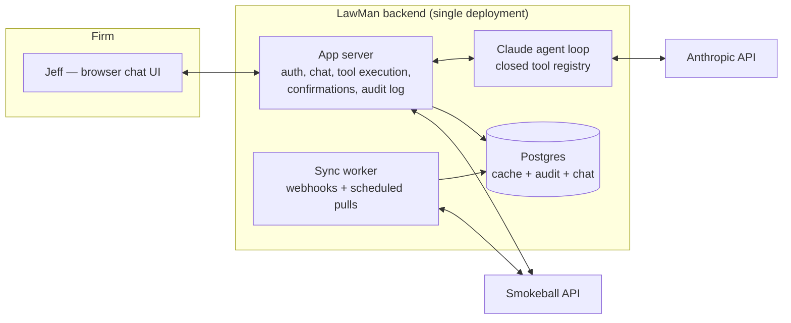

# 01 — Build Plan

## Architecture

### The key addition vs. the original plan: a sync/cache layer

The original plan implied answering everything with live API calls. That works for "what's on my calendar today" but **cannot work** for the firm-wide questions that make LawMan valuable:

- "Which matters have no activity in the last 30 days?"
- "Which active matters have no upcoming task or event?"
- "Which PI matters have settlement packages needing follow-up?"

Those require scanning every open matter's tasks, events, files, and correspondence — hundreds to thousands of API calls per question. Rate limits and latency make that impossible interactively.

So: a **sync worker** mirrors Smokeball data into Postgres — staff, matters, matter types, tasks, events, file/folder metadata, correspondence metadata — kept fresh by webhooks where Smokeball supports them and scheduled incremental pulls where it doesn't (see [docs/02](02-smokeball-api.md) for what's actually available). Firm-wide questions are answered from the cache (fast SQL); point lookups can go live; **writes always go live** to the API. Every cached row stores its Smokeball ID and last-synced timestamp; answers can say "as of 8:02 this morning."

Derived intelligence (settlement-package status, matter-health flags, "last meaningful activity") is computed by background jobs into their own tables, with the evidence (source record IDs) stored alongside every conclusion — so citations come free.

### Tool layer

Claude never generates raw API requests and never sees credentials. It calls a closed registry of typed tools (validated with Zod). Read tools roughly as the original plan enumerated (`get_calendar_events`, `get_tasks`, `search_matters`, `get_matter`, `list_matter_files`, `search_matter_emails`, `build_settlement_timeline`, …) — final list depends on the Sprint 0 capability matrix. Write tools follow the propose → confirm → execute pattern in [docs/03](03-safety-and-permissions.md).

Most read tools hit Postgres, not Smokeball — which makes them fast, rate-limit-free, and testable.

### Tech stack (concrete, boring on purpose)

| Layer | Choice | Why |
|---|---|---|
| Language | TypeScript everywhere | One language; typed tool schemas shared between agent and server |
| Backend | Node + Fastify (or Next.js API routes if we want one deployable) | Simple, well-known |
| Agent loop | Anthropic TypeScript SDK tool-use loop (or Claude Agent SDK) | Direct control over tools, streaming, confirmation interception |
| Models | Claude Sonnet for the chat loop; Haiku for bulk background extraction (email/document classification) | Cost/quality split; prompt caching for the system prompt + tool defs |
| DB | Postgres (+ Drizzle or Prisma) | Relational fits this data exactly; full-text search built in |
| Frontend | Next.js + React chat UI | Chat window, Today dashboard, confirmation cards, citations |
| Jobs | Simple in-process scheduler (node-cron) at this scale | No queue infra needed for one firm |
| Hosting | Single-tenant deploy on Fly.io / Render / Railway (US region) — or a small VPS if the firm prefers | One box, encrypted Postgres, secret store |
| Auth (app) | Email + passkey/OTP for Jeff; sessions server-side | The chat UI must have its own login, separate from the Smokeball OAuth grant |

Skip until needed: vector database, Redis, microservices, mobile apps, voice. If semantic search over documents becomes necessary, start with Postgres full-text + pgvector, partitioned by matter, per the original plan's constraints.

### UI surfaces (v1)

Chat window with streaming responses and **source-citation chips** (click → deep link into Smokeball if the API supports links; otherwise matter/record identifiers). A "Today" dashboard rendering the morning brief structurally (calendar, overdue, due today, flags). Confirmation cards for Phase-2 writes. Suggested-command chips seeded from the command library. Desktop-first; it's fine that it's a website.

## Phases

Each phase ends with a **go/no-go gate**. Don't start the next phase on a red gate.

### Sprint 0 — API feasibility (~1 week, mostly waiting on Smokeball)

Exactly as the original plan says, this comes first and gates everything. Register for developer access, get staging credentials, and produce the **capability matrix**: for each required capability (staff, matters, matter types, tasks, events, group calendars, files/folders, correspondence/emails, activity, custom fields, webhooks, deep links, rate limits) — fully / partially / not supported, with the workaround for every gap. Deliverables and the current best understanding live in [docs/02](02-smokeball-api.md). Includes a throwaway script proving: OAuth → current user → staff list → open matters → today's events → today's tasks → one matter's files + correspondence.

**Gate:** calendar, tasks, and matters are readable; we know the truth about email/correspondence access (the settlement feature's fate) and have chosen its fallback if needed.

### Sprint 1 — Walking skeleton (read-only, tiny)

OAuth token management with refresh; Postgres schema + sync worker for staff, matters, tasks, events; minimal chat UI; agent loop with ~6 read tools; source citations. Jeff can ask: today's calendar, today's/overdue tasks, basic matter lookup. Deterministic date/status logic with unit tests ([docs/04](04-testing-and-evals.md)) from day one.

**Gate:** Jeff uses it for a real morning and the answers match Smokeball exactly.

### Sprint 2 — Read-only assistant, full

Matter search and reporting from the cache (practice area, status, attorney, court-date ranges, no-upcoming-task, no-recent-activity); other staff calendars + group/office calendar; conflict detection; court-appearance reports; the full daily briefing with priority ordering; eval suite running in CI against golden staging data.

**Gate:** shadow-validation period ([docs/04](04-testing-and-evals.md)) passes — e.g. 10 consecutive mornings, zero factual errors.

### Sprint 3 — PI settlement intelligence

The highest-value, highest-risk feature; it gets its own phase. Folder traversal + settlement-package detection (file metadata first, then document text extraction where needed); matter-email search; sent-date verification (email/correspondence evidence only — never folder presence); adjuster extraction; settlement timeline with per-entry sources; follow-up gap detection. Background-computed per matter, stored with evidence, refreshed on sync.

**Gate:** on golden data: zero false "sent" claims. On real data: Jeff spot-checks N matters and confirms the timelines.

### Sprint 4 — Controlled write actions

Confirmation framework (propose/confirm/execute with single-use tokens — [docs/03](03-safety-and-permissions.md)); create calendar events (multi-calendar); create/assign tasks; reschedule non-critical tasks; hard-deadline guard with enhanced confirmation; full audit trail; conflict warnings on event creation.

**Gate:** write-action acceptance criteria below; audit log reviewed; a week of real use with zero unintended writes.

### Sprint 5 — Proactive assistant

Morning brief generated on schedule (email or in-app); matter health checks with **explained statuses** (On track / Needs attention / Waiting on client / Deadline risk / … — reasons always shown, no opaque scores); stale-matter and missing-next-task detection; settlement follow-up recommendations. Suggestions only — proactive runs never write.

### Later (parked)

Multi-user with permission enforcement (see [docs/03](03-safety-and-permissions.md) — gated on its own design), voice input, mobile, Outlook add-in, automated SMS briefs, AI Matter Summary write-back into Smokeball custom fields or a standardized matter document (per the original plan's ordering: real fields > custom fields > summary doc > AI folder).

## Acceptance criteria

**Read-only MVP (end of Sprint 2)** — Jeff can: sign in securely; get his, a colleague's, and the office calendar for any day/range; see overdue and current tasks with their matters; search active matters by practice area; get court events by matter type and date range; get answers with cited sources; get an honest "I could not verify" when data is missing; and nothing in Smokeball ever changes.

**Settlement intelligence (Sprint 3)** — for any active PI matter: whether a package was prepared (with document + date), whether it was *verifiably* sent (with email evidence, recipient, date), what happened after, and whether follow-up exists — with "sending could not be verified" as a routine honest outcome.

**Write actions (Sprint 4)** — Jeff can dictate an event conversationally; disambiguate the matter when needed; review a confirmation card; confirm; see it in Smokeball with the right calendars and matter; create and assign matter-linked tasks; reschedule a non-critical task; get an enhanced warning on deadline-related tasks; and review a complete audit trail.

## Operating costs (order of magnitude)

- Claude API: single-digit dollars/day at one-user usage with prompt caching; background extraction jobs sized to stay in that range (Haiku for bulk).
- Hosting + Postgres: ~$20–50/month.
- Smokeball API access: confirm pricing/terms in Sprint 0.

## Known risks (ranked, updated after API research — details in [docs/02](02-smokeball-api.md))

1. **API access approval** — firm API access reportedly requires the Prosper+ plan and goes through the account manager plus a security review; cost and timeline are undocumented. Start the conversation immediately; everything else waits on it.
2. **Rate limit (5 req/s)** — confirmed low; the sync/cache layer is mandatory, initial full sync must be throttled, and the sync worker needs queuing + backoff.
3. **Async writes** — all Smokeball POST/PUTs are queued; success response ≠ committed, failures arrive via an `error` webhook. The write flow gains a verify step (propose → confirm → execute → verify) before telling the user "created."
4. **Email parsing quality** — emails are readable (as downloadable files with to/from metadata), so settlement intelligence is feasible, but "was it sent" verification depends on parsing .eml/.msg files reliably. De-risk with real samples in Sprint 0/3.
5. **No deep links** — no documented way to link into a Smokeball matter/record; citations fall back to identifiers unless Sprint 0 finds working web-app URL patterns.
6. **Data quality in Smokeball** — folder-naming inconsistencies ("Settlement Package" vs variants), tasks without matters, uncategorized deadlines. Mitigation: fuzzy matching + the eval suite measures real-world hit rate; the health-check surface doubles as a data-hygiene report.
7. **Vendor overlap (Archie)** — Smokeball's own AI now does agentic matter Q&A and drafting in Word/Outlook. LawMan stays on ground Archie doesn't occupy: cross-matter reporting, settlement follow-up workflow, conversational writes, morning brief. Re-check each phase.
